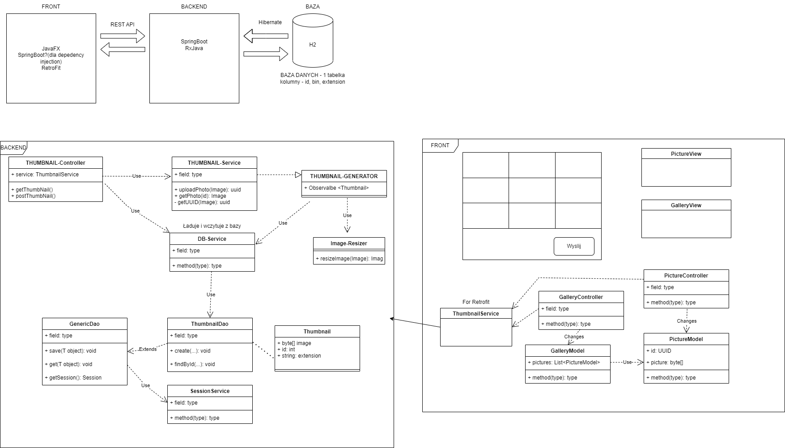

# Diagram

# Review 2

## Nowe funkcjonalności

### Nowe źródło obrazów

Można teraz po stronie servera dodawac zdjęcia do specjalnego obserwowanego folderu. Obecnie tym folderem jest *mi-pt-1640-butwiosenny\Backend\build\resources\main\com\example\backend\watcher\Images*. Do obserwowanego folderu można dodawać zdjęcia w formacie .jpg i .png, można także tworzyć strukturę zagnieżdzonych folderów, która zostanie wyświetlona w odpowiedni sposób na froncie.

### Struktura Folderów - Front

Po stronie frontu możemy teraz grupować zdjęcia w foldery, w tym potencjalnie zagnieżdzone struktury folderów.

### Rozmiary Miniatur

Za każdym razym gdy wysłamy zdjęcie na server, generuje on 3 rozmiary miniatur (*SMALL*, *MEDIUM*, *LARGE*). Na froncie za pomocą *dropdown menu* możemy wybierać jaki rozmiar miniatur chcemy widzieć.

### Restart Servera

Server przy starcie przeszukuje baze danych w poszukiwaniu zdjęć bez wygenerowanych miniatur oraz tych z wygenerowanymi tylko niektórymi rozmiarami miniatur. Następnie przekazuje znalezione braki do generatora miniatur aby je uzupełnić (generowane są tylko wymagane rozmiary).